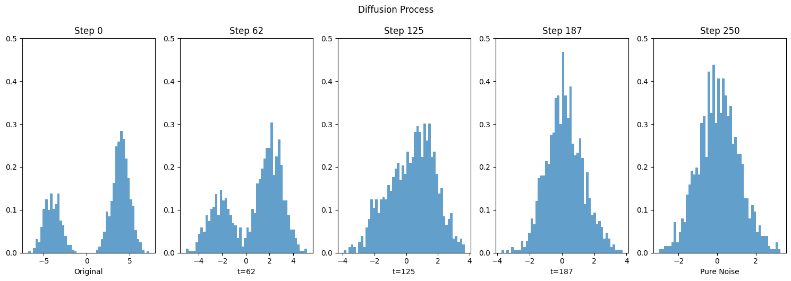
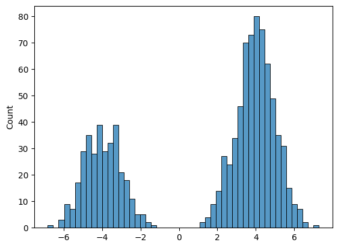
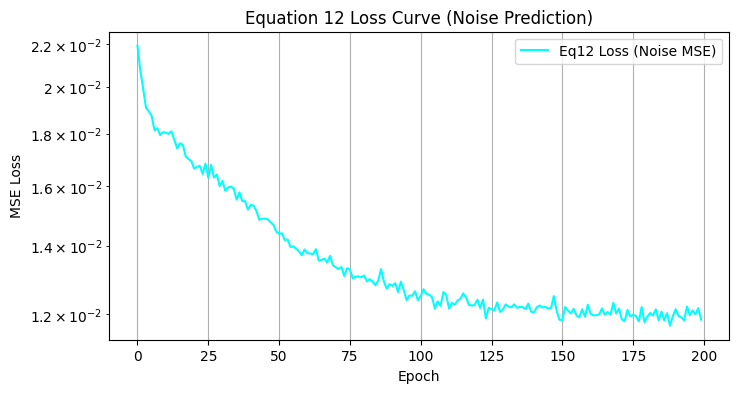
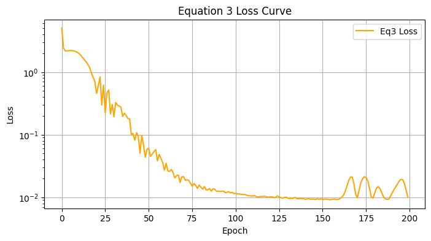
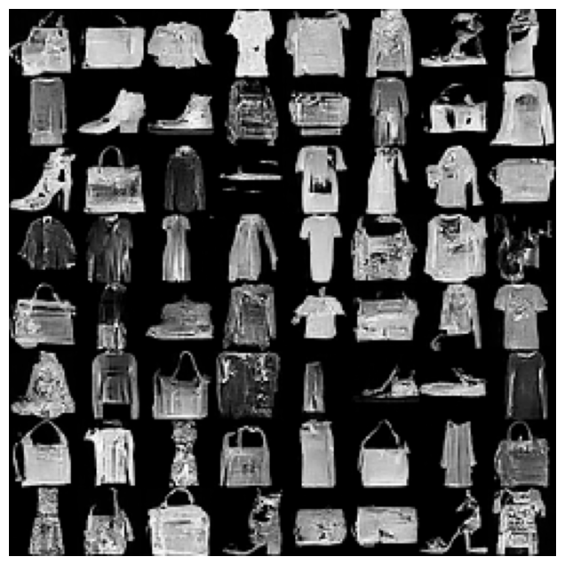

# Homework 2 — Denoising Diffusion Probabilistic Models (DDPM)

This repository contains my implementation and analysis of Denoising Diffusion Probabilistic Models (DDPM).  
The work is presented in a single Jupyter notebook and includes:
- Forward diffusion process visualization
- Reverse sampling procedure
- Loss objectives (ε-prediction formulation)
- Training experiments
- Qualitative results on generated data

---

## Repository Structure

```
.
├── HW2_318280294.ipynb     # Main assignment notebook
├── images/                 # Exported result figures
└── README.md               # (This file)
```

---

## How to Run

```bash
jupyter notebook HW2_318280294.ipynb
```

or

```bash
jupyter lab
```

Run the notebook from start to finish to reproduce results.

---

## Results (Figures)

### Diffusion & Reverse Sampling
| Description | Image |
|---|---|
| Forward diffusion process (adding noise over timesteps) |  |
| Reverse sampling using Eq. 12 |  |
| Reverse sampling using Eq. 3  |  |

### Distribution Comparisons
| Description | Image |
|---|---|
| GMM distribution used in the assignment |  |
| Distribution comparison (Eq. 12) |  |
| Distribution comparison (Eq. 3)  |  |

### Loss Curves
| Description | Image |
|---|---|
| Loss curve for ε-prediction loss (Eq. 12) |  |
| Loss curve for ε-prediction loss (Eq. 3)  |  |

### Generated Samples
| Description | Image |
|---|---|
| Samples generated by the trained DDPM |  |

---

## Reproducibility Notes

- If needed, record package versions:
  ```bash
  pip freeze > requirements.txt
  ```
- Ensure random seed is fixed for deterministic sampling comparisons.
- All figures are stored under `images/` and linked directly in this README.

---

## License
This repository is for academic coursework.  
Do not redistribute without permission.
